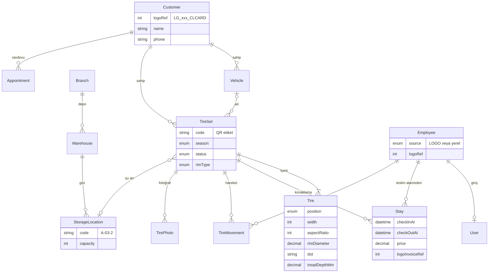

# Veri Modeli (Taslak)

Kaynak: `api/prisma/schema.prisma`. Firma görüşmesinden sonra netleşecek.

## Temel kararlar

- **LOGO'ya yazılmaz.** `Customer` ve `Employee`, LOGO kayıtlarının yerel kopyasıdır (`logoRef` = `LOGICALREF`). LOGO kapalıyken de uygulama çalışır.
- **Lastik takımı (`TireSet`) merkezde.** Etiketteki QR kodu takımın `code` alanıdır; rafta okutulunca takıma ulaşılır.
- **Lastik bazında detay (`Tire`).** Ön ve arka lastikleri farklı ebatta olan araçlar ile her lastiğin ayrı DOT ve diş derinliği için gerekli.
- **Konaklama (`Stay`) ve hareket (`TireMovement`) ayrı.** `Stay` ücret ve fatura dönemidir. `TireMovement` her giriş, raf değişikliği ve çıkışın kim tarafından yapıldığını gösteren denetim izidir.
- **`TireSet.currentLocationId`** "şu an nerede" sorusuna hızlı cevap verir. Geçmiş hareketler `TireMovement`'ta durur.

## Firmaya sorulacaklar (şemayı etkiler)

| Soru | Etkilediği yer |
|---|---|
| Kaç şube ve depo var? Raf adresleme nasıl (koridor-raf-kat)? | `Branch`, `Warehouse`, `StorageLocation` |
| Bir göze bir takım mı konuyor, yoksa birkaç takım mı? | `StorageLocation.capacity` |
| Ücret nasıl belirleniyor: sezonluk sabit, jantlı/jantsız farkı, ebada göre? | `Stay.price`; gerekirse ayrı bir fiyat listesi tablosu |
| Fatura LOGO'dan mı kesilecek, uygulama kessin mi? | `Stay.logoInvoiceRef` |
| LOGO'da olmayan yeni müşteri uygulamadan açılabilir mi, yoksa önce LOGO'da mı açılmalı? | `Customer.logoRef` boş olabilir mi |
| Lastik bazında DOT ve diş derinliği ölçülüyor mu, yoksa takım bazında mı yeterli? | `Tire` tablosunun detayı |
| Personel LOGO Bordro'da mı? Kimler sisteme giriş yapacak? | `Employee.source`, `User` |
| Teslimde fotoğraf veya imza isteniyor mu? | `TirePhoto`, ileride imza alanı |
| Bekleme süresi dolmuş, sahipsiz kalan lastiklere ne yapılıyor? | `TireSetStatus.DISPOSED` |
